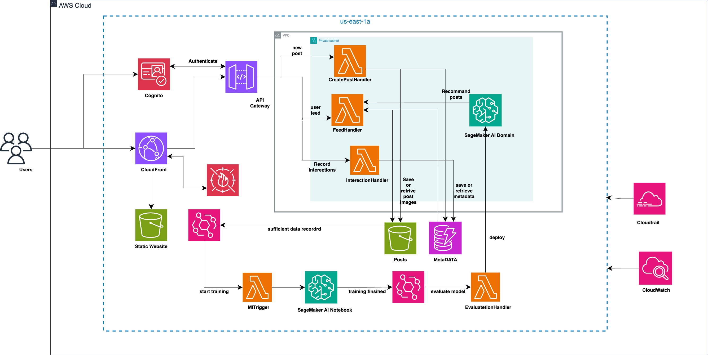

# CloudGram 📸☁️

CloudGram is a fully serverless, cloud-native social media platform built on AWS that combines the power of modern web technologies with automated machine learning pipelines for intelligent content recommendations. This platform demonstrates enterprise-grade serverless architecture patterns while delivering a seamless social media experience.

## Features

### Core Functionality
- **Photo Sharing & Social Feed**: Upload, share, and discover photos with a modern, responsive interface
- **Real-time Interactions**: Like, comment, and engage with content in real-time
- **User Management**: Secure authentication and user profile management
- **Scalable Storage**: Optimized image storage and delivery via AWS CloudFront CDN

### AI-Powered Recommendations
- **Automated ML Pipeline**: Fully automated machine learning workflow that analyzes user behavior patterns
- **Intelligent Content Discovery**: Advanced recommendation engine that suggests relevant content based on user preferences and interactions
- **Real-time Analytics**: Continuous learning system that adapts recommendations based on user engagement
- **Behavioral Analysis**: Smart algorithms that understand user preferences and content affinity

### Serverless Architecture
- **100% Serverless**: No server management required - scales automatically based on demand
- **Cost-Effective**: Pay only for what you use with AWS Lambda and serverless services
- **High Availability**: Built-in redundancy and fault tolerance across multiple AWS regions
- **Auto-Scaling**: Handles traffic spikes seamlessly without manual intervention

## Architecture Overview



*The architecture showcases a fully serverless implementation using AWS services including Lambda, DynamoDB, S3, API Gateway, and SageMaker for ML operations.*

## Technology Stack

### Backend Services
- **AWS Lambda**: Serverless compute for all API operations
- **Amazon API Gateway**: RESTful API management and routing
- **Amazon DynamoDB**: NoSQL database for user data and content metadata
- **Amazon S3**: Object storage for images and static content
- **Amazon CloudFront**: Global CDN for fast content delivery
- **Amazon SageMaker**: Machine learning model training and inference
- **AWS Step Functions**: Orchestration of ML pipeline workflows
- **Amazon EventBridge**: Event-driven architecture for real-time updates

### Frontend
- Modern web application with API integration
- Responsive design for mobile and desktop
- Real-time updates and notifications

### ML Pipeline Components
- **Data Collection**: Automated user behavior tracking
- **Feature Engineering**: Real-time feature extraction from user interactions
- **Model Training**: Scheduled retraining with new data
- **Inference Engine**: Real-time recommendation serving
- **A/B Testing**: Continuous model performance evaluation

## Quick Start

### Prerequisites
- AWS CLI configured with appropriate permissions
- AWS account with sufficient service limits
- Node.js (for frontend development)

### Deployment Steps

1. **Clone the Repository**
   ```bash
   git clone https://github.com/PreetPatel45/CloudGram.git
   cd CloudGram
   ```

2. **Deploy Infrastructure**
   
   The infrastructure is deployed using 4 CloudFormation templates in sequential order:
   
   ```bash
   # Deploy core infrastructure
   aws cloudformation create-stack \
     --stack-name cloudgram-core \
     --template-body file://CF_templates/upload_file_template.yaml \
     --capabilities CAPABILITY_IAM
   
   # Deploy API and compute resources
   aws cloudformation create-stack \
     --stack-name cloudgram-api \
     --template-body file://CF_templates/recommendations.yaml \
     --capabilities CAPABILITY_IAM
   
   # Deploy ML pipeline
   aws cloudformation create-stack \
     --stack-name cloudgram-ml \
     --template-body file://CF_templates/CF_templates/ML_Pipeline.yaml \
     --capabilities CAPABILITY_IAM
   
   # Deploy monitoring and analytics
   aws cloudformation create-stack \
     --stack-name cloudgram-monitoring \
     --template-body file://CF_templates/loggging_monitoring.yaml \
     --capabilities CAPABILITY_IAM
   ```

3. **Configure Frontend**
   
   After successful deployment, update the API endpoint in your frontend configuration:
   
   ```javascript
   // Update src/config/api.js
   const API_ENDPOINT = 'https://your-api-gateway-url.amazonaws.com/prod';
   ```
   
   Get your API Gateway URL from the CloudFormation stack outputs:
   ```bash
   aws cloudformation describe-stacks \
     --stack-name cloudgram-api \
     --query 'Stacks[0].Outputs[?OutputKey==`ApiGatewayUrl`].OutputValue' \
     --output text
   ```

4. **Deploy Frontend**
   ```bash
   cd frontend
   npm install
   npm run build
   npm run deploy
   ```

### Environment Variables

The CloudFormation templates automatically configure most environment variables. For local development, create a `.env` file:

```env
REACT_APP_API_ENDPOINT=https://your-api-gateway-url.amazonaws.com/prod
REACT_APP_AWS_REGION=us-east-1
REACT_APP_USER_POOL_ID=your-cognito-user-pool-id
REACT_APP_USER_POOL_CLIENT_ID=your-cognito-client-id
```

## CloudFormation Templates

### 1. Core Infrastructure (`01-core-infrastructure.yaml`)
- VPC and networking components
- S3 buckets for storage
- DynamoDB tables
- IAM roles and policies

### 2. API & Compute (`02-api-compute.yaml`)
- API Gateway configuration
- Lambda functions for core functionality
- Cognito for authentication
- CloudFront distribution

### 3. ML Pipeline (`03-ml-pipeline.yaml`)
- SageMaker training and inference endpoints
- Step Functions for ML workflows
- EventBridge rules for automation
- Lambda functions for ML operations

### 4. Monitoring & Analytics (`04-monitoring-analytics.yaml`)
- CloudWatch dashboards and alarms
- X-Ray tracing
- Analytics and logging infrastructure

## ML Pipeline Architecture

### Automated Training Pipeline
1. **Data Ingestion**: User interactions are automatically captured and stored
2. **Feature Engineering**: Real-time feature extraction using Lambda functions
3. **Model Training**: Scheduled training jobs using SageMaker with automatic hyperparameter tuning
4. **Model Deployment**: Automated deployment to SageMaker endpoints for inference
5. **Performance Monitoring**: Continuous monitoring and A/B testing of model performance

### Recommendation Engine
- **Content-Based Filtering**: Analyzes image features and user preferences
- **Collaborative Filtering**: Leverages user behavior patterns for recommendations
- **Hybrid Approach**: Combines multiple algorithms for optimal results
- **Real-time Serving**: Sub-second recommendation response times

### ML Workflow Automation
- **Trigger-Based Training**: Automatically retrains models when new data thresholds are met
- **Model Versioning**: Automatic versioning and rollback capabilities
- **Performance Tracking**: Continuous monitoring of recommendation accuracy and user engagement
- **Cost Optimization**: Intelligent resource allocation based on usage patterns

## Monitoring & Analytics

- **Real-time Dashboards**: Monitor application performance and user engagement
- **ML Model Metrics**: Track recommendation accuracy and model drift
- **Cost Analytics**: Monitor and optimize AWS resource usage
- **User Behavior Insights**: Detailed analytics on user interactions and content preferences

## Security Features

- **Authentication**: AWS Cognito for secure user management
- **Authorization**: Fine-grained IAM policies for resource access
- **Data Encryption**: Encryption at rest and in transit
- **API Security**: Rate limiting and request validation
- **Content Security**: Automated content moderation capabilities

## Cost Optimization

- **Serverless Architecture**: Pay-per-use pricing model
- **Intelligent Scaling**: Automatic resource scaling based on demand
- **Storage Optimization**: Intelligent tiering for S3 storage
- **ML Cost Management**: Spot instances and scheduled training for cost efficiency

## Performance Characteristics

- **Global Scale**: CloudFront CDN for worldwide content delivery
- **Sub-second Response Times**: Optimized API responses with caching
- **High Availability**: 99.9% uptime with multi-AZ deployment
- **Auto-scaling**: Handles 10x traffic spikes automatically

## Contributing

1. Fork the repository
2. Create a feature branch (`git checkout -b feature/amazing-feature`)
3. Commit your changes (`git commit -m 'Add amazing feature'`)
4. Push to the branch (`git push origin feature/amazing-feature`)
5. Open a Pull Request

## License

This project is licensed under the MIT License - see the [LICENSE](LICENSE) file for details.

## Support

For questions and support:
- Create an issue in this repository
- Check the [documentation](./docs)
- Review CloudFormation template comments for detailed configuration options

## Acknowledgments

- AWS Serverless Application Model (SAM) community
- SageMaker ML pipeline best practices
- Open source serverless patterns and examples

---

**CloudGram** - Where serverless architecture meets intelligent social media experiences. Built with ❤️ using AWS serverless technologies.